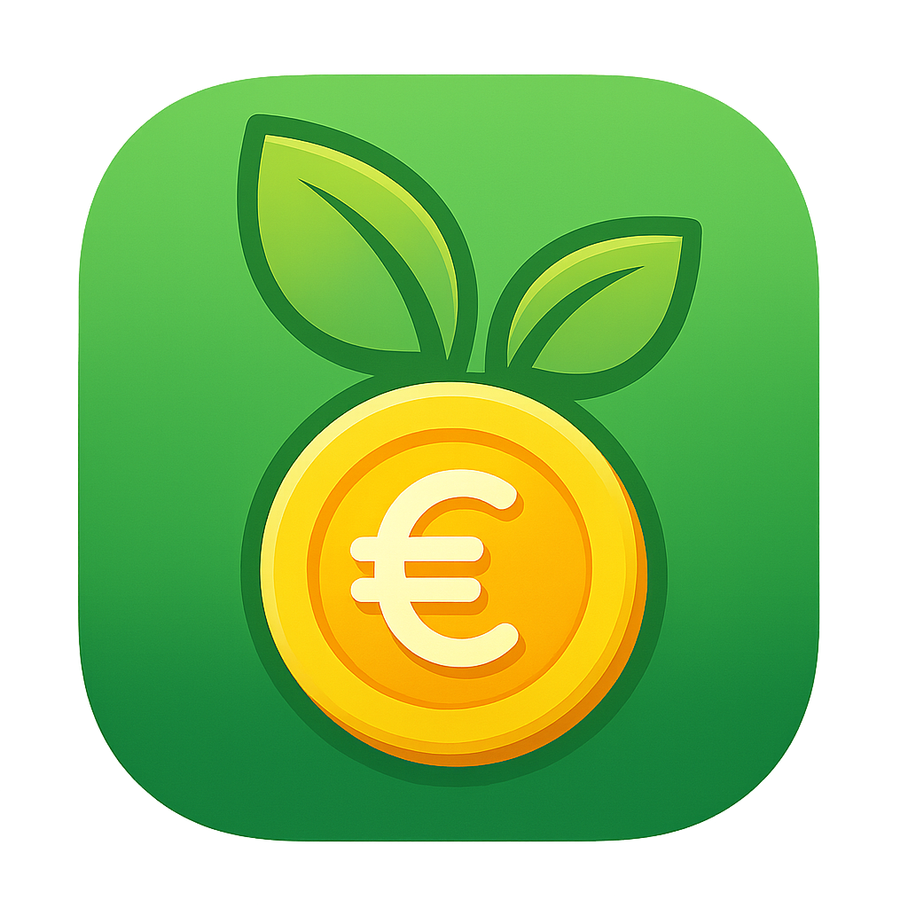

# CityClean



CityClean è un'applicazione mobile che incentiva i cittadini a partecipare attivamente alla raccolta differenziata e a mantenere la città pulita attraverso un sistema di gamification. Gli utenti possono guadagnare punti, ottenere badge, completare missioni e riscattare premi, trasformando la cura dell'ambiente in un'esperienza coinvolgente e gratificante.

## 🚀 Funzionalità Principali

- **🏠 Home:** Una dashboard personalizzata con le informazioni principali sull'attività dell'utente.
- **🗺️ Mappa:** Visualizzazione dei punti di raccolta e degli eventi ecologici in città.
- **🏆 Gamification:**
  - **🏅 Badge:** Distintivi speciali ottenuti al raggiungimento di determinati obiettivi.
  - **🎯 Missioni e Obiettivi:** Sfide periodiche per guadagnare punti extra.
  - **🎁 Premi:** Un catalogo di premi riscattabili con i punti accumulati.
- **👥 Social:**
  - **🤝 Gruppi Temporanei:** Crea o unisciti a gruppi di 24 ore per ottenere bonus sui conferimenti.
  - **🛡️ Gilde:** Funzionalità social più strutturate (in sviluppo).
- **🎉 Eventi:** Partecipa a eventi di pulizia e sensibilizzazione organizzati dalla community o dall'amministrazione.
- **👤 Profilo Utente:** Gestisci il tuo profilo, visualizza le tue statistiche, lo storico dei conferimenti e i premi riscattati.
- **📷 Scanner QR:** Registra i tuoi conferimenti scansionando un codice QR per accumulare punti.
- **👑 Admin:** Un pannello di controllo per la gestione dell'applicazione (utenti, premi, eventi).

## 🔧 Installazione e Avvio

Per eseguire il progetto in locale, segui questi passaggi:

**Prerequisiti:**

-   [Flutter SDK](https://docs.flutter.dev/get-started/install) installato e configurato.
-   Un editor di codice come [Android Studio](https://developer.android.com/studio) o [Visual Studio Code](https://code.visualstudio.com/).

**Procedura:**

1.  **Clona il repository:**
    ```bash
    git clone https://github.com/tuo-username/cityclean.git
    cd cityclean
    ```

2.  **Installa le dipendenze:**
    ```bash
    flutter pub get
    ```

3.  **Configura le variabili d'ambiente:**
    -   Crea un file `.env` nella root del progetto.
    -   Aggiungi le tue credenziali di Supabase come segue:
        ```
        PROJECT_URL="IL_TUO_URL_SUPABASE"
        API_KEY="LA_TUA_API_KEY_SUPABASE"
        ```

4.  **Avvia l'applicazione:**
    ```bash
    flutter run
    ```

## 🏗️ Struttura del Progetto

Il codice sorgente è organizzato seguendo una struttura chiara e modulare:

```
lib/
├── api/           # Logica per le chiamate API
├── components/    # Widget riutilizzabili
├── controllers/   # Gestione dello stato e logica di business (Provider)
├── data/          # Dati statici o di configurazione
├── models/        # Modelli di dati (es. User, Badge, Event)
├── screens/       # Widget che rappresentano le schermate dell'app
├── services/      # Servizi di backend (es. Supabase, Notifiche)
├── utils/         # Funzioni di utilità e helper
└── main.dart      # Punto di ingresso dell'applicazione
```

## 📦 Dipendenze Principali

-   [supabase_flutter](https://pub.dev/packages/supabase_flutter): Integrazione con il backend Supabase.
-   [provider](https://pub.dev/packages/provider): Per la gestione dello stato.
-   [flutter_dotenv](https://pub.dev/packages/flutter_dotenv): Per la gestione delle variabili d'ambiente.
-   [intl](https://pub.dev/packages/intl): Per la formattazione di date e numeri.

## 🤝 Contributi

I contributi sono benvenuti! Se vuoi migliorare il progetto, apri una issue per discutere la tua idea o invia una pull request con le tue modifiche.

## 🤝 Team di Sviluppo
1. Project Manager:
-  Antonio Ferrentino
-  Francesco Perilli
2. Team Members:
-  Michele Bartoli
-  Luigi Balsio
-  Pio Cascone
-  Domenico di Caprio
-  Saverio Di Perna
-  Antonio Pio Gargiulo
-  Marco Ianniello
-  Amanda Pia Caterina Robertazzi 
-  Vittorio Ruotolo
-  Paolo Maria Siconolfi
-  Davide Valiante

## 📄 Licenza

Questo progetto è distribuito sotto la licenza MIT. Vedi il file `LICENSE` per maggiori dettagli.
